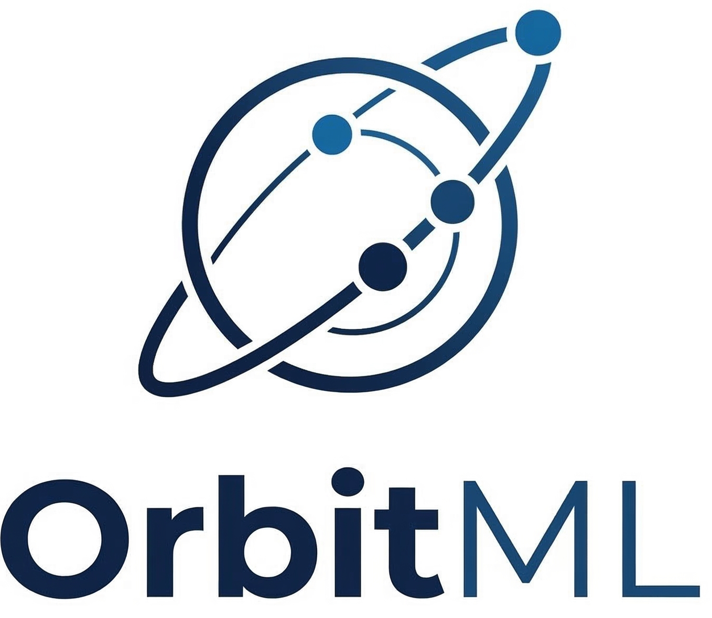

# orbit4ml

<p align="center">
  
</p>

<p align="center">
  <a href="https://github.com/orbit-ml/orbit4ml/actions"></a>
  <a href="https://pypi.org/project/orbit4ml/"></a>
  <a href="https://github.com/orbit-ml/orbit4ml/blob/main/LICENSE"></a>
</p>

---

**orbit4ml** is an open ecosystem for machine learning in space.

Space is the next frontier for intelligent systems — but running ML in orbit, on the lunar surface, or deep in the solar system is fundamentally different from running it in a terrestrial data center. orbit4ml brings together the libraries, tools, and frameworks needed to navigate that gap.

## Why orbit4ml?

Deploying ML in space introduces a unique set of constraints that terrestrial frameworks are not designed for:

- **Compute** — radiation-hardened processors run at a fraction of the speed and capability of modern GPUs. FPGAs and ASICs dominate.
- **Bandwidth** — downlink windows are short and expensive. Models must process data on-board and transmit only what matters.
- **Latency** — the speed of light makes real-time ground control loops impossible beyond LEO. Autonomy is not optional.
- **Data scarcity** — labeled datasets from space missions are rare. Federated and continual learning approaches are essential.
- **Reliability** — cosmic ray bit flips, thermal cycling, and single-event upsets demand fault-tolerant training and inference.

orbit4ml is built to address these constraints directly, providing implementations and abstractions that space ML practitioners can use out of the box.

## Overview

orbit4ml is organized into focused submodules:

- **`orbit4ml.sim`** — Physics-based orbital digital twin: SGP4 propagation, eclipse modeling, thermal constraints, inter-satellite links, and fault injection.
- **`orbit4ml.data`** — Datasets, transforms, and loaders for space imagery, telemetry, and scientific observations.
- **`orbit4ml.train`** — Constraint-aware training loops for large models: power-aware scheduling, thermal throttling, checkpoint/resume across eclipse cycles (coming in v0.2).
- **`orbit4ml.fed`** — Federated learning across satellite constellations with topology-aware aggregation (coming in v1.0).
- **`orbit4ml.compress`** — Model compression, quantization, and pruning pipelines for bandwidth-constrained missions (coming in v0.3).
- **`orbit4ml.edge`** — Inference engines targeting space-grade hardware: FPGAs, radiation-tolerant SoCs (coming in v0.3).
- **`orbit4ml.bench`** — Standardized benchmarks and evaluation protocols (coming in v0.2).

## Installation

```bash
pip install orbit4ml
```

## Quick Start

```python
from datetime import datetime
import torch
from orbit4ml.sim import Constellation, DigitalTwin

# Create a 66-satellite constellation
constellation = Constellation(
    planes=6, sats_per_plane=11, altitude=550, inclination=53.0
)
twin = DigitalTwin(constellation)

# Simulate training under orbital constraints
model = torch.nn.Sequential(torch.nn.Flatten(), torch.nn.Linear(3 * 64 * 64, 10))
optimizer = torch.optim.Adam(model.parameters())

for epoch in twin.propagate(start=datetime(2026, 6, 1), hours=0.5, step_seconds=60):
    for sat in epoch.satellites:
        if sat.power.available and sat.thermal.within_budget:
            batch = torch.randn(8, 3, 64, 64)
            labels = torch.randint(0, 10, (8,))
            loss = torch.nn.functional.cross_entropy(model(batch), labels)
            loss.backward()
            optimizer.step()
            optimizer.zero_grad()
```

## Citation

If you use orbit4ml in your research, please cite:

```bibtex
@software{orbit4ml2026,
  author  = {Mainak Mallick},
  title   = {orbit4ml: An Open Ecosystem for Machine Learning in Space},
  year    = {2026},
  url     = {https://github.com/orbit-ml/orbit4ml}
}
```

## Acknowledgements & Friends

orbit4ml draws inspiration from [learn2learn](https://learn2learn.net), [PyTorch](https://pytorch.org), and the broader open-source ML community. We also draw on the excellent work coming out of space agencies, satellite operators, and the NewSpace community pushing the boundaries of on-board intelligence.
